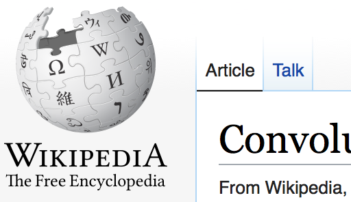

❤: filters

# Image Filtering

To filter an image, we take a weighted average of pixels in a window around each pixel. We will use a quadratic Gaussian approximation to create a <span class="def">filter function $f$</span> that applies to <span class="def">values $x$ in $[-1,1]$</span>:

```iheartla
f(x) = { 1-3x²               if |x| < ⅓
         1.5x² - 3|x| + 1.5  if |x| < 1
         0 otherwise where x ∈ ℝ
```

<figure>
```python
from lib import *
import numpy as np
import skimage.io
import scipy.signal

# Initialize our filter function
r = 5
f = filters().f

# Store the function into a filter kernel
filter = np.zeros((2*r+1, 2*r+1))
for i in range( 2*r+1 ):
    for j in range( 2*r + 1 ):
        filter[ i,j ] = f( (i-r)/r ) * f( (j-r)/r )

# Normalize the filter.
filter /= filter.sum()

img = skimage.io.imread( "wikipedia.png" )

output = np.stack( [ scipy.signal.convolve2d( img[:,:,c], filter, mode='same', boundary='symm' ) for c in range( img.shape[2] ) ], axis=2)

skimage.io.imsave( "output.png", output )
```


<figcaption>Top: The input image. Bottom: The filtered image.</figcaption>
</figure>
